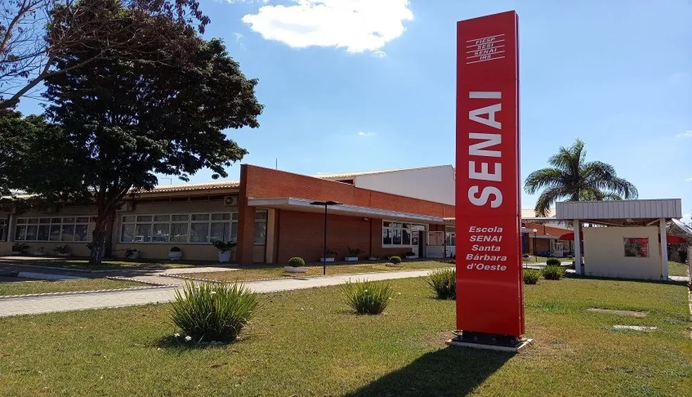

# aula-2702_01- MANUAL DO ALUNO: 

 A Escola Senai de Alvares Romi iniciou as atividades em
25 de fevereiro de 1958 como Unidade de Formação
Profissional junto as instalações das Indústrias Romi
S.A.
 A escola oferece áreas escolares como a biblioteca, cantina, secretária, AAPM - Associação de Alunos, Pais e
Mestres (promovendo a integração entre a escola e a comunidade.), área de qualidade de vida, e disponibiliza itens para prevenção de acidentes.
 Respeitam às diferenças, o pluralismo de ideias e garante o padrão de qualidade, fornecendo todo o apoio necessário para seus alunos. Esses são alguns dos princípios que
norteiam a atuação do SENAI-SP.
  As escolas SENAI-SP seguem procedimentos de saúde
e segurança específicos para cada ambiente, incluindo
o uso de roupas adequadas, equipamentos de
segurança e acessórios conforme a atividade e as
normas regulamentadoras de cada área.
 
